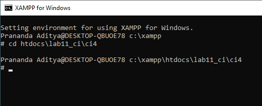
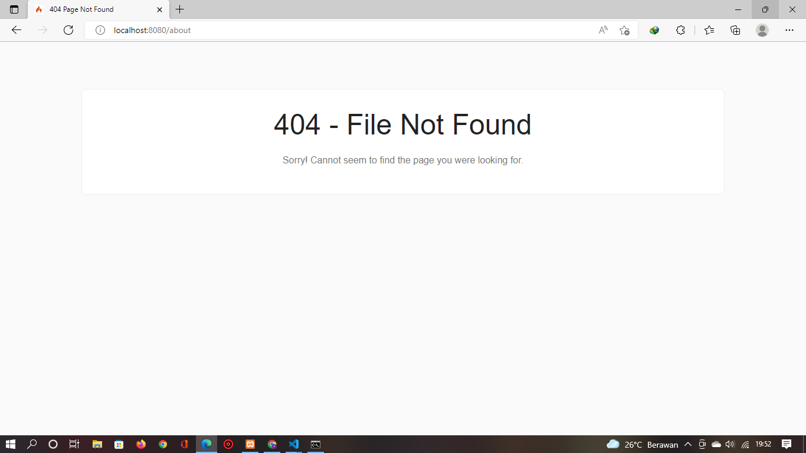

# Lab11Web

## Nama : Prananda Aditya

## NIM : 312010130

## Kelas : TI.20.A1

## Matkul : Pemoggraman 

---
[Praktikum 11](#praktikum-11-php-framework-codeigniter)<br>
[Praktikum 12](#praktikum-12-framework-lanjutan-crud)<br>
[Praktikum 13](#praktikum-13-framework-lanjutan-modul-login)<br>
---
---
<br>
# Praktikum 11 PHP Framework (Codeigniter)
# Langkah-langkah Praktikum

## Persiapan

<br>Sebelum memulai menggunakan Framework Codeigniter, perlu dilakukan konfigur pada webserver. Beberapa ekstensi PHP perlu diaktifkan untuk kebutul penembangan Codengniter 4.

<br>Berikut beberapa ekstensi yang perlu diaktifkan
<br>> php-json ekstension untuk bekerja dengan JSON
<br>> php-mysqlnd native driver untuk MYSQL;
<br>> php-xml ekstension untuk bekerja dengan XML;
<br>> php-intl ekstensi untuk membuat aplikasi multibahasa;
<br>> libcurl (opsional), jika ingin pakai curl

<br>Untuk mengaktifkan ekstentsi tersebut, melalu XAMPP Control Panel, pada bagian
Apache klik Config -> PHP.ini

<br>Pada bagian extention, hilangkan tanda ; (titik koma) pada ekstensi yang akan
diaktifkan. Kemudian simpan kembali filenya dan restart Apache web server.


## Instalsasi Codeigniter 4

<br>Untuk melakukan instalasi Codeigniter 4 dapat dilakukan dengan 2 cara, yaitu cara manual dan menggunakan composer. pada praktikum ini kita menggunkan cara manual.
<br>> Unduh Codeigniter dari Website https://codeigniter.com/download
<br>> Ektak zip Codeigniter ke direktori htdoc/lab11_ci.
<br>> Ubah nama direktory framework-4.x.xx maenjadi ci4.
<br>> Buka browser dengan alamat http://localhost/lab11_ci/ci4/public/


## Menjalankan CLI(Command line Interface)

<br>Codeigniter 4 menyediakan CLI untuk mempermudah proses development. Untuk mengakses CLI buka terminal/Command prompt.

<br>Arahkan lokasi direktori sesuai dengan direktori kerja project dibuat(xampp/htdocs/lab11_ci/ci4)

<br>Perintah yang dapat dijalankan untuk memanggil CLI Codeigniter adalah :

```
php spark
```


## Mengaktifkan Mode Debugging

<br>Codeigniter 4 menyediakan fitur debugging untuk memudahkan developer untuk
mengetahui pesan error apabila terjadi kesalahan dalam membuat kode program.
<br>Secara default fitur ini belum aktif. Ketika terjadi error pada aplikasi akan ditampilkan
pesan kesalahan seperti berikut.

<br>Semua jenis error akan ditampilkan sama. Untuk memudahkan mengetahui jenis
errornya, maka perlu diaktifkan mode debugging dengan mengubah nilai konfigurasi
pada environment variable CI_ENVIRINMENT menjadi development.

<br>Ubah nama file env menjadi .env kemudian buka file tersebut dan ubah nilai variable CI_ENVIRINMENT menjadi development.
<br>Contoh error yang terjadi. Untuk mencoba error tersebut, ubah kode pada file app/Controller/Home.php hilangkan titik koma pada akhir kode.


## Struktur Direktori

<br>Untuk lebih memahami Framework Codeigniter 4 perlu mengetahui struktur direktori dan file yang ada. Buka pada Windows Explorer atau dari Visual Studio Code -> Open Folder.
<br> Terdapat beberapa direktori dan file yang perlu dipahami fungsi dan kegunaannya.
<br>• .github folder ini kita butuhkan untuk konfigurasi repo github, seperti konfigurasi untuk build dengan github action;
<br>• app folder ini akan berisi kode dari aplikasi yang kita kembangkan;
<br>• public folder ini berisi file yang bisa diakses oleh publik, seperti file index.php, robots.txt, favicon.ico, ads.txt, dll;
<br>• tests folder ini berisi kode untuk melakukan testing dengna PHPunit;
<br>• vendor folder ini berisi library yang dibutuhkan oleh aplikasi, isinya juga termasuk kode core dari system CI.
<br>• writable folder ini berisi file yang ditulis oleh aplikasi. Nantinya, kita bisa pakai untuk menyimpan file yang di-upload, logs, session, dll.

<br>Sedangkan file - file yang berada pada root direktori CI sebagai Berikut
<br>•.env adalah file yang berisi variable environment yang dibutuhkan oleh aplikasi.
<br>•.gitignore adalah file yang berisi daftar nama file dan folder yang akan diabaikan oleh git.
<br>•build adalah script untuk mengubah versi codeigniter yang digunakan ada versi release (stabil) dan development (labil).
<br>• composer.json adalah file JSON yang berisi informasi tentang proyek dan daftar library yang dibutuhkannya. File ini digunakan oleh Composer sebagai acuan.
<br>• composer.lock adalah file yang berisi informasi versi dari libraray yang digunakan aplikasi.
<br>• license.txt adalah file yang berisi penjelasan tentang lisensi Codeigniter;
<br>• phpunit.xml.dist adalah file XML yang berisi konfigurasi untuk PHPunit.
<br>• README.md adalah file keterangan tentang codebase CI. Ini biasanya akan dibutuhkan pada repo github atau gitlab.
<br>• spark adalah program atau script yang berfungsi untuk menjalankan server, generate kode, dll.

<br>Fokus kita pada folder app, dimana folder tersebut adalah area kerja kita untuk membuat aplikasi. dan folder public untuk menyimpan aset web seperti css, gambar, javascript, dll.

## Memahami Konsep MVC

<br>Pada Codeigniter, request yang diterima oleh file index.php akan diarahkan ke Router untuk meudian oleh router tesebut diarahkan ke Controller.
<br>Router terletak pada file app/config/Routes.php

<br>Pada file tersebut kita dapat mendefinisikan route untuk aplikasi yang kita buat, Contoh :

```
$routes->get('/', 'Home::index');
```

<br>Kode tersebut akan mengarahkan rute untuk halaman home

## Membuat Route baru.

<br>Tambahkan kode berikut di dalam Routes.php

```
$routes->get('/about', 'Page::about');
$routes->get('/contact', 'Page::contact');
$routes->get('/faqs', 'Page::faqs');
```

<br>Untuk mengetahui route yang ditambahkan sudah benar, buka CLI dan jalankan perintah berikut.

```
php spark routes
```


<br>Selanjutnya coba akses route yang telah dibuat dengan mengakses alamat url http://localhost:8080/about

<br>Ketika diakses akan mucul tampilan error 404 file not found, itu artinya file/page tersebut tidak ada. Untuk dapat mengakses halaman tersebut, harus dibuat terlebih dahulu Contoller yang sesuai dengan routing yang dibuat yaitu Contoller Page.

## Membuat Controller

<br>Selanjutnya adalah membuat Controller Page. Buat file baru dengan nama page.php
pada direktori Controller kemudian isi kodenya seperti berikut.

```
<?php
namespace App\Controllers;
class Page extends BaseController
{
 public function about()
 {
 echo "Ini halaman About";
 }
 public function contact()
 {
 echo "Ini halaman Contact";
 }
 public function faqs()
 {
 echo "Ini halaman FAQ";
 }
}
```

<br>Selanjutnya refresh Kembali browser,


## Auto Routing

<br>Secara default fitur autoroute pada Codeiginiter sudah aktif. Untuk mengubah status autoroute dapat mengubah nilai variabelnya. Untuk menonaktifkan ubah nilai true menjadi false.

```
$routes->setAutoRoute(true);
```

<br>Tambahkan method baru pada Controller Page Seperti berikut.

```
public function tos()
{
 echo "ini halaman Term of Services";
}
```

<br>Method ini belum ada pada routing, sehingga cara mengaksesnya dengan menggunakan alamat: http://localhost:8080/page/tos


## Membuat View

<br>Selanjutnya adalah membuat view untuk tampilan web agar lebih menarik, Buat file baru dengan nama about.php pada direktori view (app/view/about.php)kemudian isi kodenya seperti berikut.

```
<!DOCTYPE html>
<html lang="en">
<head>
 <meta charset="UTF-8">
 <title><?= $title; ?></title>
</head>
<body>
 <h1><?= $title; ?></h1>
 <hr>
 <p><?= $content; ?></p>
</body>
</html>
```

<br>Ubah method about pada class Controlleer Page menjadi seperti berikut:

```
public function about()
{
 return view('about', [
 'title' => 'Halaman Abot',
 'content' => 'Ini adalah halaman abaut yang menjelaskan tentang isi
halaman ini.'
 ]);
}
```

<br>Kemudian lakukan refresh pada halaman tersebut.


## Membuat Layout Web dengan CSS

<br>Pada dasarnya layout web dengan css dapat diimplamentasikan dengan mudah pada codeigniter. Yang perlu diketahui adalah, pada Codeigniter 4 file yang menyimpan asset css dan javascript terletak pada direktori public.
<br>Buat file css pada direktori public dengan nama style.css (copy file dari praktikumlab4_layout. Kita akan gunakan layout yang pernah dibuat pada praktikum 4.

<br>Kemudian buat folder template pada direktori view kemudian buat file header.php dan footer.php
<br>File app/view/template/header.php

```
<!DOCTYPE html>
<html lang="en">
<head>
 <meta charset="UTF-8">
 <title><?= $title; ?></title>
 <link rel="stylesheet" href="<?= base_url('/style.css');?>">
</head>
<body>
 <div id="container">
 <header>
 <h1>Layout Sederhana</h1>
 </header>
 <nav>
 <a href="<?= base_url('/');?>" class="active">Home</a>
 <a href="<?= base_url('/artikel');?>">Artikel</a>
 <a href="<?= base_url('/about');?>">About</a>
 <a href="<?= base_url('/contact');?>">Kontak</a>
 </nav>
 <section id="wrapper">
 <section id="main">
```

<br>File app/view/template/footer.php

```
</section>
 <aside id="sidebar">
<div class="widget-box">
 <h3 class="title">Widget Header</h3>
 <ul>
 <li><a href="#">Widget Link</a></li>
 <li><a href="#">Widget Link</a></li>
 </ul>
 </div>
 <div class="widget-box">
 <h3 class="title">Widget Text</h3>
 <p>Vestibulum lorem elit, iaculis in nisl volutpat, malesuada
tincidunt arcu. Proin in leo fringilla, vestibulum mi porta, faucibus felis.
Integer pharetra est nunc, nec pretium nunc pretium ac.</p>
 </div>
 </aside>
 </section>
 <footer>
 <p>&copy; 2021 - Universitas Pelita Bangsa</p>
 </footer>
 </div>
</body>
</html>
```

<br>Kemudian ubah file app/view/about.php seperti berikut.

```
<?= $this->include('template/header'); ?>
<h1><?= $title; ?></h1>
<hr>
<p><?= $content; ?></p>
<?= $this->include('template/footer'); ?>
```

<br>Selanjutnya refresh tampilan pada alamat http://localhost:8080/about


---

# Praktikum 12 Framework Lanjutan (CRUD)

# langkah - langkah Praktikum

## Persiapan

<br>Untuk memulai membuat database aplikasi CRUD sederhana, yang perlu disiapkan adalah database server menggunakan MySQL Server sudah dapat di jalankan melalui XAMPP.

## Membuat Database
```
CREATE DATABASE lab_ci4;
```


## Membuat Tabel
```
CREATE TABLE artikel (
 id INT(11) auto_increment,
 judul VARCHAR(200) NOT NULL,
 isi TEXT,
 gambar VARCHAR(200),
 status TINYINT(1) DEFAULT 0,
 slug VARCHAR(200),
 PRIMARY KEY(id)
);
```


## Konfigurasi Koneksi Database

<br>Selanjutnya membuat konfigurasi untuk menghubungkan dengan database server. Konfigurasi dapat dilakukan dengan dua acara, yaitu pada file **app/config/database.php** atau menggunakan file **.env**. Pada praktikum ini kita gunakan konfigurasi pada file **.env**.
```php
#-----------------------------------
# DATABASE
#-----------------------------------

database.default.hostname = localhost
database.default.database = lab_ci4
database.default.username = root
database.default.password = 
database.default.DBDriver = MySQLi
database.default.DBPrefix =

```

## Membuat Controller

<br>Buat controller baru dengan nama **Artikel.php** padadirektori **app/Controllers**
```php
<?php
namespace app\Controllers;
use app\Models\ArtikelModel;
class Artikel extends BaseController
{
    public function index()
    {
        $title = 'Daftar Artikel';
        $model = new ArtikelModel();
        $artikel = $model->findALL();
        return view('artikel/index', compact('artikel','title'));
    }
}
```

## Membuat View

<br>Buat direktori baru dengan nama **artikel** pada direktori **app/view**. Dan buat file **index.php** kemudian isi dengan kode berikut :
```php
<?= $this->include('template/header'); ?>

<?php if($artikel): foreach($artikel as $row): ?>
<article class="entry">
    <h2<a href="<?= base_url('/artikel/' . $row['slug']);?>"><?=
    $row['judul']; ?></a>
    </h2>
    " alt="<?=
    $row['judul']; ?>">
    <p><?= substr($row['isi'], 0, 200); ?></p>
</article>
<hr class="divider" />
<?php endforeach; else: ?>
<article class="entry">
    <h2>Belum ada data.</h2>
</article>
<?php endif; ?>

<?= $this->include('template/footer'); ?>
```

Selanjutnya buka browser dengan url `http://localhost:8080/artikel`


belum ada data yang ditampilkan. Kemudian coba tambahkan beberapa data pada database agar dapat ditampilkan dataya.
```
INSERT INTO artikel (judul, isi, slug) VALUE 
('Artikel pertama', 'Lorem Ipsum adalah contoh teks atau dummy dalam industri percetakan dan penataan huruf atau typesetting. Lorem Ipsum telah menjadi standar contoh teks sejak tahun 1500an, saat seorang tukang cetak yang tidak dikenal mengambil sebuah kumpulan teks dan mengacaknya untuk menjadi sebuah buku contoh huruf.', 'artikel-pertama'),
('Artikel kedua', 'Tidak seperti anggapan banyak orang, Lorem Ipsum bukanlah teks-teks yang diacak. Ia berakar dari sebuah naskah sastra latin klasik dari era 45 sebelum masehi, hingga bisa dipastikan usianya telah mencapai lebih dari 2000 tahun.', 'artikel-kedua');
 ```

Refresh browser untuk melihat hasilya


## Membuat Tampilan Detail Artikel
<br>Tampilan pada saat judul berita di klik maka akan diarahkan ke halaman yang berbeda. Tambahkan fungsi baru pada **Controller/Artikel** dengan nama **view().**
```php
public function view($slug)
    {
        $model = new ArtikelModel();
        $artikel = $model->where([
            'slug' => $slug
        ])->first();
        // Menampilkan error apabila data tidak ada.
        if (!$artikel) 
        {
            throw PageNotFoundException::forPageNotFound();
        }
        $title = $artikel['judul'];
        return view('artikel/detail', compact('artikel', 'title'));
    }
```

## Membuat Routing Untuk Artikel Detail
Buka kembali file **app/config/Routes.php**, kemudian tambahkan routing untuk artikel detail.
```php
$routes->get('/artikel/(:any)', 'Artikel::view/$1');
```

Klik salah satu judul artikel untuk melihat hasilnya.


## Membuat Menu Admin
<br>Menu admin adalah untuk proses CRUD data artikel. Buat method baru pada **Controller/Artikel** dengan nama **admin_index()**.
```php
public function admin_index() 
    {
        $title = 'Daftar Artikel';
        $model = new ArtikelModel();
        $artikel = $model->findAll();
        return view('artikel/admin_index', compact('artikel', 'title'));
    }
```

Selanjutnya buat view untuk tampilan admin pada **Views/artikel** dengan nama **admin_index.php**
```php
<?= $this->include('template/admin_header'); ?>
<table class="table table-bordered table-hover">
    <thead>
        <tr class="table-primary">
            <th scope="col">ID</th>
            <th scope="col">Judul</th>
            <th scope="col">Status</th>
            <th scope="col">Aksi</th>
        </tr>
    </thead>
    <tbody>
        <?php if($artikel): foreach($artikel as $row): ?>
        <tr>
            <td><?= $row['id']; ?></td>
            <td>
                <b><?= $row['judul']; ?></b>
                <p><small><?= substr($row['isi'], 0, 50); ?></small></p>
            </td>
            <td><?= $row['status']; ?></td>
            <td>
                <a class="btn btn-primary p-1" href="<?= base_url('/admin/artikel/edit/' . 
                $row['id']);?>">Ubah</a>
                <a class="btn btn-danger p-1" onclick="return confirm('Yakin menghapus data?');" href="<?= base_url('/admin/artikel/delete/' . 
                $row['id']);?>">Hapus</a>
            </td>
        </tr>
        <?php endforeach; else: ?>
        <tr>
            <td colspan="4">Belum ada data.</td>
        </tr>
        <?php endif; ?>
    </tbody>
    <tfoot>
        <tr class="table-primary">
            <th scope="col">ID</th>
            <th scope="col">Judul</th>
            <th scope="col">Status</th>
            <th scope="col">Aksi</th>
        </tr>
    </tfoot>
</table>
<?= $this->include('template/admin_footer'); ?>
```

Tambahkan routing untuk menu admin 
```php
$routes->group('admin', function($routes) {
    $routes->get('artikel', 'Artikel::admin_index');
    $routes->add('artikel/add', 'Artikel::add');
    $routes->add('artikel/edit/(:any)', 'Artikel::edit/$1');
    $routes->get('artikel/delete/(:any)', 'Artikel::delete/$1');
    });
```

Untuk melihat menu admin dengan menggunakan url `http://localhost:8080/admin/artikel`


## Menambahkan Data Artkel
<br>Tambahkan fungsi/methode baru pada **Controlle/Artikel** dengan nama **add()**
```php
public function add() 
    {
        // validasi data.
        $validation = \Config\Services::validation();
        $validation->setRules(['judul' => 'required']);
        $isDataValid = $validation->withRequest($this->request)->run();

        if ($isDataValid)
        {
            $artikel = new ArtikelModel();
            $artikel->insert([
                'judul' => $this->request->getPost('judul'),
                'isi' => $this->request->getPost('isi'),
                'slug' => url_title($this->request->getPost('judul')),
            ]);
            return redirect('admin/artikel');
        }
        $title = "Tambah Artikel";
        return view('artikel/form_add', compact('title'));
    }
```

Kemudain buat view untuk form tambah data denga nama **form_add.php**
```php
<?= $this->include('template/admin_header'); ?>
<h2><?= $title; ?></h2>
<form action="" method="post">
    <p><input type="text" name="judul"></p>
    <p><textarea name="isi" cols="50" rows="10"></textarea></p>
    <p><input type="submit" value="Kirim" class="btn btn-large"></p>
</form>
<?= $this->include('template/admin_footer'); ?>

```

Untuk melihat menu tambah dengan url `http://localhost:8080/admin/artikel/add`


## Mengubah Data
<br>Tambahkan fungsi/methode baru pada **Controller/Admin** dengan nama **edit()**.
```php
public function edit($id) 
    {
        $artikel = new ArtikelModel();

        // validasi data.
        $validation = \Config\Services::validation();
        $validation->setRules(['judul' => 'required']);
        $isDataValid = $validation->withRequest($this->request)->run();

        if ($isDataValid)
        {
            $artikel->update($id, [
                'judul' => $this->request->getPost('judul'),
                'isi' => $this->request->getPost('isi'),
            ]);
            return redirect('admin/artikel');
        }
        
        // ambil data lama
        $data = $artikel->where('id', $id)->first();
        $title = "Edit Artikel";
        return view('artikel/form_edit', compact('title', 'data'));
    }
```

Untuk mengakses menu edit bisa dengan mengklik tombol **Ubah** pada menu admin.


## Menghapus Data
<br> Tambahkan fungsi/methode baru pada **Controller/Artikel dengan nama **delet()**
```php
public function delete($id) 
    {
        $artikel = new ArtikelModel();
        $artikel->delete($id);
        return redirect('admin/artikel');
    }
```

Untuk menghapus artikel bisa dengan mengklik tombol **Hapus** pada menu admin.


---

# Praktikum 13 Framework Lanjutan (Modul Login)

# Langkah - Langkah Praktikum

## Persiapan
<br>Untuk membuat modul login, yang perlu disiapkan adalah database server menggunakan MySQL. Pastikan MySQL Server sudah dapat dijalankan melalui XAMPP

## Membuat Tabel : User Login
```php
CREATE TABLE user (
  id INT(11) auto_increment,
  username VARCHAR(200) NOT NULL,
  useremail VARCHAR(200),
  userpassword VARCHAR(200),
  PRIMARY KEY(id) 
);
```

## Membuat Model User
<br>Selanjutnya membuat model user untuk memproses data login. Buat file baru pada direktori **app/Models** dengan nama **UserModel.php**
```php
<?php
namespace App\Models;
use CodeIgniter\Model;
class UserModel extends Model
{
    protected $table = 'user';
    protected $primaryKey = 'id';
    protected $useAutoIncrement = true;
    protected $allowedFields = ['username', 'useremail', 'userpassword'];
}
```

## Membuat Control User
<br>Membuat Controller baru dengan nama User.php pada direktori **app/Controllers**. Kemudian tambahkan methode **index()** untuk menampilkan daftar user, dan methode login() untuk proses login.
```php
<?php
namespace App\Controllers;
use App\Models\UserModel;
class User extends BaseController
{
    public function index()
    {
        $title = 'Daftar User';
        $model = new UserModel();
        $users = $model->findAll();
        return view('user/index', compact('users', 'title'));
    }
    public function login()
    {
        helper(['form']);
        $email = $this
            ->request
            ->getPost('email');
        $password = $this
            ->request
            ->getPost('password');
        if (!$email)
        {
            return view('user/login');
        }
        $session = session();
        $model = new UserModel();
        $login = $model->where('useremail', $email)->first();
        if ($login)
        {
            $pass = $login['userpassword'];
            if (password_verify($password, $pass))
            {
                $login_data = [
                    'user_id' => $login['id'],
                    'user_name' => $login['username'],
                    'user_email' => $login['useremail'],
                    'logged_in' => true,
                ];
                $session->set($login_data);
                return redirect('admin/artikel');
            }
            else
            {
                $session->setFlashdata("flash_msg", "Password salah.");
                return redirect()
                    ->to('/user/login');
            }
        }
        else
        {
            $session->setFlashdata("flash_msg", "email tidak terdaftar.");
            return redirect()
                ->to('/user/login');
        }
    }
}
```

## Membuat View Login
<br>Buat direktori baru dengannama **user** pada direktori **app/views**,kemudian buat file baru dengan nama **login.php**
```html
<!DOCTYPE html>
<html>
<head>
    <title>Login</title>
	<link rel="stylesheet" href="<?= base_url('/style.css');?>">
</head>
<body>
    <?php if(session()->getFlashdata('flash_msg')):?>
		<div class="alert alert-danger">
			<?= session()->getFlashdata('flash_msg') ?>
		</div>
	<?php endif;?>

    <div class="login_box">
		<p class="login_text">SignIn</p>
		<form action="" method="post">
			<label for="InputForEmail" class="form-label">Email address</label>
			<input type="email" name="email" class="form_login" id="InputForEmail" value="<?= set_value('email') ?>" placeholder="Username or email ...">

			<label for="InputForPassword" class="form-label">Password</label>
			<input type="password" name="password" class="form_login" id="InputForPassword" placeholder="Password ...">

			<button type="submit" class="btn btn_primary">Login</button>
		</form>
	</div>
</body>
</html>
```

